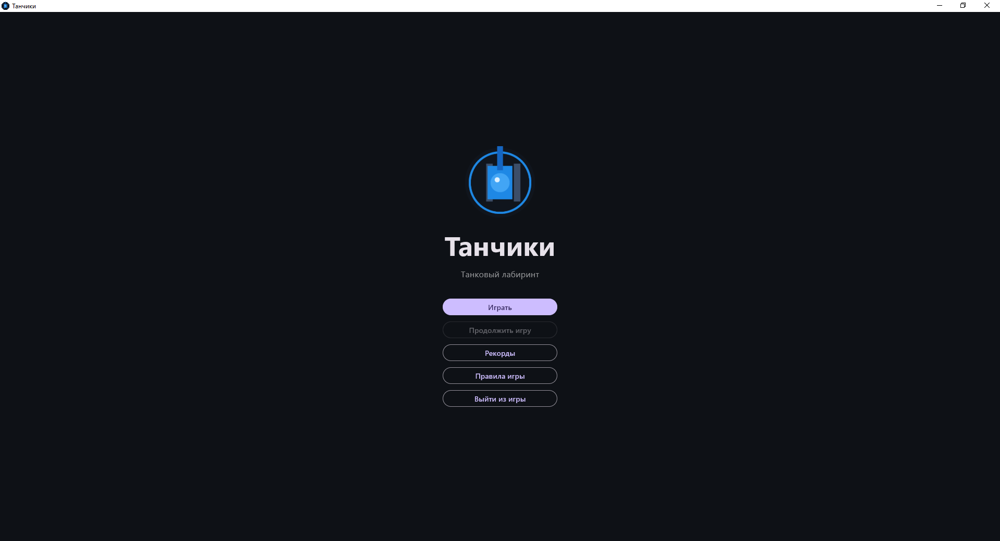
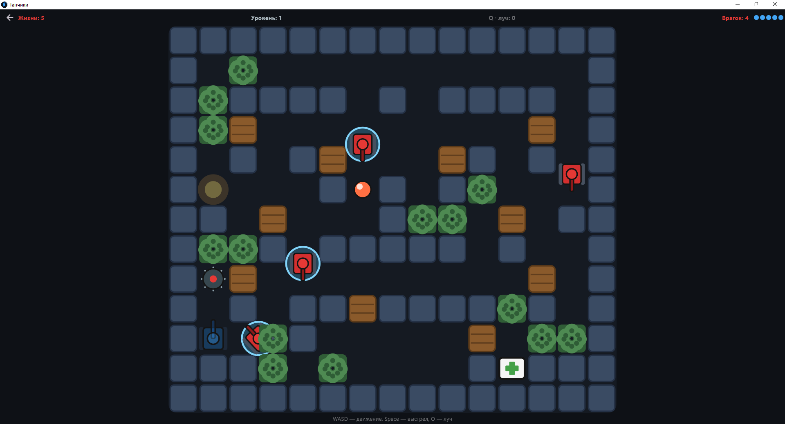

<p align="center">
  
</p>

<h1 align="center">Танчики</h1>

<p align="center">
  Аркадная игра-лабиринт: управляй танком, расчищай лабиринт от врагов
  и пробивайся всё дальше по бесконечным уровням.
</p>

<p align="center">
  Flutter • Windows • Android • без игровых движков
</p>

## Об игре

Ты — синий танк в лабиринте. На каждом уровне спрятаны вражеские танки:
уничтожь всех — откроется следующий уровень с новым лабиринтом и врагами
посложнее. Уровни бесконечные, а рекорд — как далеко ты забрался.

## Скриншоты

| Главное меню | Геймплей |
| --- | --- |
|  |  |

## Возможности

- **Бесконечные уровни** — лабиринт и враги генерируются заново, с каждым
  уровнем врагов становится больше.
- **6 жизней** — попадание вражеской стрелки отнимает одну. Аптечка
  восстанавливает жизнь, а за каждый пройденный уровень дают +1.
- **Разные враги** — обычные и бронированные: у бронированных сначала
  снимается голубой щит, и только второе попадание убивает.
- **Оружие и способности:**
  - пушка — обычный выстрел (5 зарядов, восстанавливаются со временем);
  - **Q** — луч, выжигает коридор по 1 урону в секунду (заряд за каждые
    3 убийства);
  - **F** — тройной залп (открывается после 5 убийств, до 5 зарядов,
    переносятся между уровнями).
- **Живой лабиринт** — кирпичные стены ломаются выстрелами, синие
  неразрушимые; снаряды игрока и врагов сталкиваются и взрываются.
- **Мины и кусты** — мины наносят урон всем, кто наедет, но их всегда можно
  объехать; в кустах танки плохо видны.
- **Рекорды и сохранение** — таблица лучших результатов, пауза и продолжение
  сохранённой игры.
- **Три способа играть** — клавиатура, геймпад Xbox и экранные кнопки
  на телефоне.

## Управление

| Действие | Клавиатура | Геймпад Xbox | Телефон |
| --- | --- | --- | --- |
| Движение | W A S D или стрелки | левый стик или крестовина | крестовина слева |
| Выстрел | Space | A | кнопка «Огонь» |
| Луч | Q | B | кнопка «Луч» |
| Тройной залп | F | X | кнопка «Тройной» |
| Пауза | Esc | Start | кнопка паузы |

## Как поиграть

1. Скачай `tanks.exe` из раздела **Releases** этого репозитория.
2. Запусти файл — игра откроется в окне, установка не нужна.
3. Или собери сам из исходников (см. ниже) — так же можно собрать версию
   для Android.

## Как собрать из исходников

Нужен [Flutter](https://docs.flutter.dev/get-started/install).

```bash
flutter pub get

# запуск на Windows
flutter run -d windows

# сборка exe для Windows
flutter build windows --release
# результат: build\windows\x64\runner\Release\tanks.exe

# сборка APK для Android
flutter build apk --release
# результат: build\app\outputs\flutter-apk\app-release.apk
```

Проверки:

```bash
flutter analyze
flutter test
```

## Технологии

- **Flutter / Dart** — весь интерфейс и игровой цикл.
- **CustomPainter** — вся графика рисуется кодом, без спрайтов и движков.
- **dart:ffi + XInput** — поддержка геймпада Xbox.
- **flutter_test** — тесты логики игры, сохранений и рекордов.
- Логотип рисуется скриптом `tool/draw_logo.dart` (пакет `image`).

## Структура проекта

```
lib/
  main.dart      — меню, экран игры, отрисовка и управление
  game.dart      — логика: лабиринт, враги, выстрелы, способности
  gamepad.dart   — геймпад Xbox через XInput
  records.dart   — таблица рекордов
  save.dart      — сохранение и загрузка игры
test/            — тесты
tool/draw_logo.dart — скрипт, который рисует логотип
assets/images/   — логотип и другие картинки
```

## Лицензия

Проект распространяется по лицензии [MIT](LICENSE) — код можно свободно
использовать, менять и делиться им.
